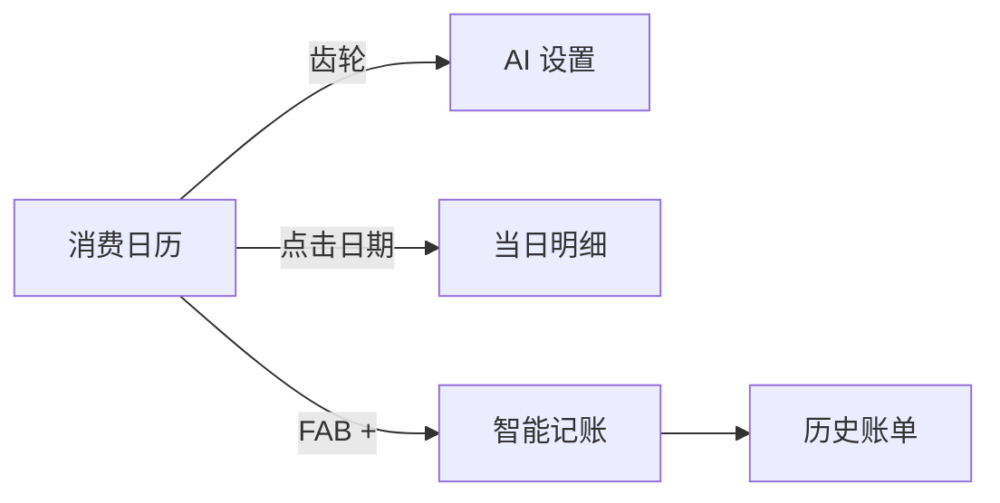

# VibeSpendAnalyzer · AI 消费分析助手

一款 Android 原生个人记账应用：用**消费日历**掌握支出节奏，用大模型为每笔消费生成幽默又理性的点评，并用 **Room** 在本地持久化全部账单。

> 源码中**不包含任何 API Key**。AI 凭证由用户在 App 内自行配置，仅存于设备本地。

---

## 目录

- [功能概览](#功能概览)
- [应用导航](#应用导航)
- [技术栈](#技术栈)
- [架构设计](#架构设计)
- [隐私与安全](#隐私与安全)
- [环境要求](#环境要求)
- [快速开始](#快速开始)
- [项目结构](#项目结构)
- [参与贡献](#参与贡献)
- [许可证](#许可证)

---

## 功能概览

| 模块 | 说明 |
|------|------|
| **消费日历** | 月历网格展示每日支出汇总，热力色深浅反映当日支出高低；顶部显示本月总支出与记账笔数 |
| **当日明细** | 点击任意日期查看该日全部记录，支持删除单笔账单 |
| **智能记账** | 输入金额与消费内容，调用 OpenAI 兼容接口生成 ≤100 字 AI 点评，成功后自动入库 |
| **历史账单** | 按时间倒序展示金额、内容、时间与 AI 诊断全文；重启 App 后数据不丢失 |
| **AI 设置** | 独立配置页，填写 API Key、Base URL、模型名；未配置 Key 时拦截网络请求并提示 |

**默认 AI 配置**

| 项 | 默认值 |
|----|--------|
| Base URL | `https://api.deepseek.com/v1` |
| 模型 | `deepseek-chat` |

兼容所有 OpenAI Chat Completions 格式的服务（DeepSeek、Kimi 等），Base URL 支持多种写法，会自动补全 `/v1/chat/completions` 路径。

---

## 应用导航

```
消费日历（首页）
├── 右上角齿轮 → AI 设置
├── 点击日期   → 当日明细
└── 右下角 +   → 智能记账
                    └── 历史账单
```



---

## 技术栈

| 类别 | 选型 |
|------|------|
| 语言 | Kotlin 2.2 |
| UI | Jetpack Compose · Material 3 |
| 导航 | Navigation Compose |
| 持久化 | Room 2.7 + KSP |
| 异步 | Kotlin Coroutines |
| 响应式 | Flow + `collectAsState` |
| 网络 | OkHttp 4 |
| 配置存储 | SharedPreferences |

**SDK 版本**：minSdk 24 · targetSdk 36 · compileSdk 36

---

## 架构设计

```
┌─────────────────────────────────────────┐
│           UI Layer (Compose)            │
│  Calendar · Record · History · Settings │
└─────────────────┬───────────────────────┘
                  │ collectAsState / suspend
┌─────────────────▼───────────────────────┐
│   ExpenseRepository · AiSettingsStore   │
└────────┬──────────────────┬─────────────┘
         │                  │
┌────────▼────────┐  ┌──────▼──────────────┐
│  Room / SQLite  │  │ SharedPreferences   │
│  vibe_spend.db  │  │ ai_settings (Key…)  │
└─────────────────┘  └─────────────────────┘
```

- **数据层**：`ExpenseRepository` 封装 Room CRUD；`ExpenseAnalytics` 负责日历聚合统计
- **AI 层**：`AiChatClient` 封装 OpenAI 兼容 HTTP 请求，与业务数据存储完全隔离
- **UI 层**：各 Screen 通过 Flow 订阅数据库变化，无需手动刷新

---

## 隐私与安全

| 原则 | 做法 |
|------|------|
| 零硬编码密钥 | 不在源码、`build.gradle.kts`、`BuildConfig` 或 `local.properties` 中注入 API Key |
| 本地存储 | 凭证仅存于设备 `SharedPreferences`（`ai_settings`），不上传、不进版本库 |
| 版本库隔离 | `.gitignore` 已排除 `local.properties`、`secrets.properties`、`build/` 等 |

若曾在旧版本将 Key 写入配置文件，请在服务商控制台**轮换密钥**后再使用新 Key。

---

## 环境要求

- [Android Studio](https://developer.android.com/studio)（推荐最新稳定版）
- JDK 17+（Android Gradle Plugin 9.x 要求）
- Android SDK（API 36）
- 可联网的真机或模拟器（调用 AI 接口时需要）

---

## 快速开始

### 1. 克隆仓库

```bash
git clone https://github.com/eula9/VibeSpendAnalyzer.git
cd VibeSpendAnalyzer
```

### 2. 配置 SDK 路径

复制示例文件并填入本机 Android SDK 路径：

```powershell
# Windows
copy local.properties.example local.properties
```

```bash
# macOS / Linux
cp local.properties.example local.properties
```

编辑 `local.properties`，仅设置 `sdk.dir`。**不要在此文件填写 API Key。**

### 3. 编译运行

**方式 A — Android Studio**

1. 打开项目 → **Sync Project with Gradle Files**
2. 连接真机或启动模拟器 → 点击 **Run**

**方式 B — 命令行**

```bash
# Windows
.\gradlew.bat installDebug

# macOS / Linux
./gradlew installDebug
```

### 4. 配置 AI（首次使用）

1. 打开 App，进入首页**消费日历**
2. 点击右上角**设置（齿轮）**
3. 填写 **API Key**、**Base URL**、**模型名** → **保存设置**
4. 点击 **+** 进入记账页，输入消费并体验 AI 分析

---

## 项目结构

```
app/src/main/java/com/example/vibespendanalyzer/
├── MainActivity.kt              # 入口，初始化 Room 与 AI 设置
├── AiChatClient.kt              # OpenAI 兼容 HTTP 客户端
├── data/
│   ├── AiSettings.kt            # 配置数据模型
│   ├── AiSettingsStore.kt       # SharedPreferences 读写
│   ├── AiSettingsRepository.kt
│   ├── ExpenseRepository.kt     # 消费记录仓库
│   ├── ExpenseAnalytics.kt      # 日历聚合统计
│   └── local/
│       ├── ExpenseRecord.kt     # Room @Entity
│       ├── ExpenseDao.kt
│       └── AppDatabase.kt
├── navigation/
│   └── AppNavigation.kt         # 路由与 NavHost
└── ui/
    ├── VibeStyles.kt            # 统一视觉主题
    ├── SpendingCalendarScreen.kt
    ├── HomeScreen.kt            # 智能记账
    ├── HistoryScreen.kt
    ├── AiSettingsScreen.kt
    ├── DayDetailScreen.kt
    ├── ExpenseItemCard.kt
    └── calendar/
        ├── CalendarModels.kt
        └── CalendarUtils.kt
```

---

## 参与贡献

欢迎提交 Issue 与 Pull Request。提交前请确认：

- [ ] 未包含个人 API Key 或 `local.properties`
- [ ] 未提交 `app/build/` 等构建产物
- [ ] 已在真机验证：设置 → 记账 → 重启后数据仍在

---

## 许可证

本项目采用 [MIT License](LICENSE) 开源。使用 AI 服务须遵守对应服务商的使用条款。

---

**VibeSpendAnalyzer** — 让每一笔消费，都花得明明白白。
